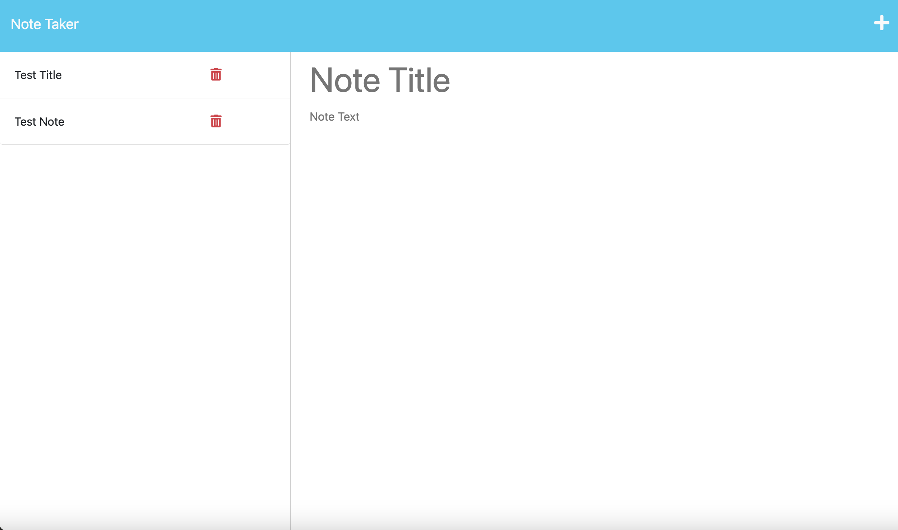

# Express.js Challenge: Note Taker
The Express.js Note taker is a lightweight web application that lets user create, store and delete notes.

## Installation
1. Clone this repo
2. run npm i to download dependencies 
```bash
npm i
```
3. run server.js to start server
```bash
node server.js
```

## Usage
Users can use the "+" button in the upper right hand corner to begin a new note and then save the note using the save icon as well. Users can then delete notes they no longer need using the red delete button next to each note.

## Screenshot of Deployed Application


## Link to Deployed Application
https://nameless-plateau-31258.herokuapp.com/